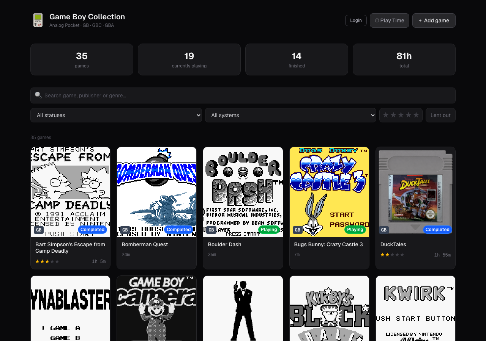
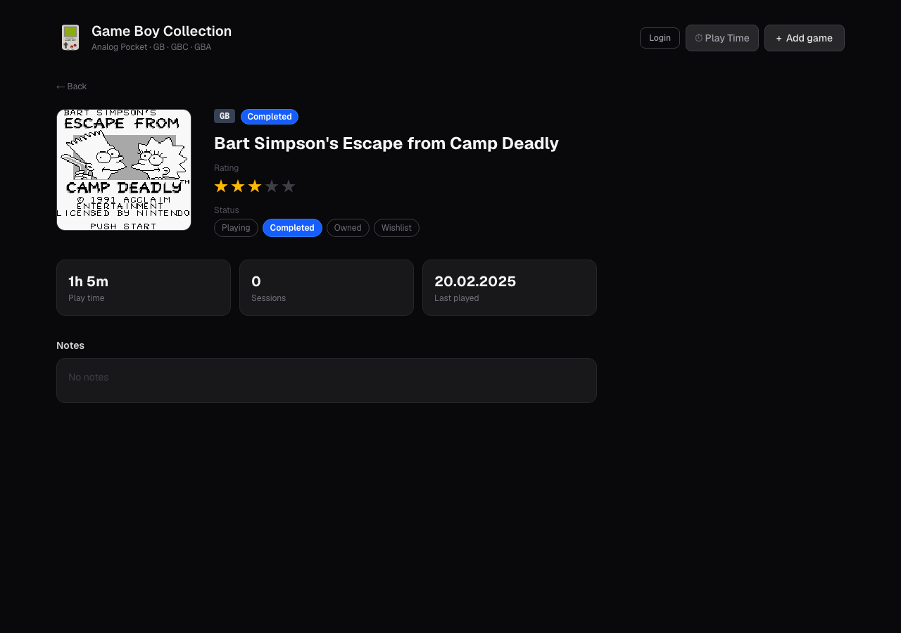
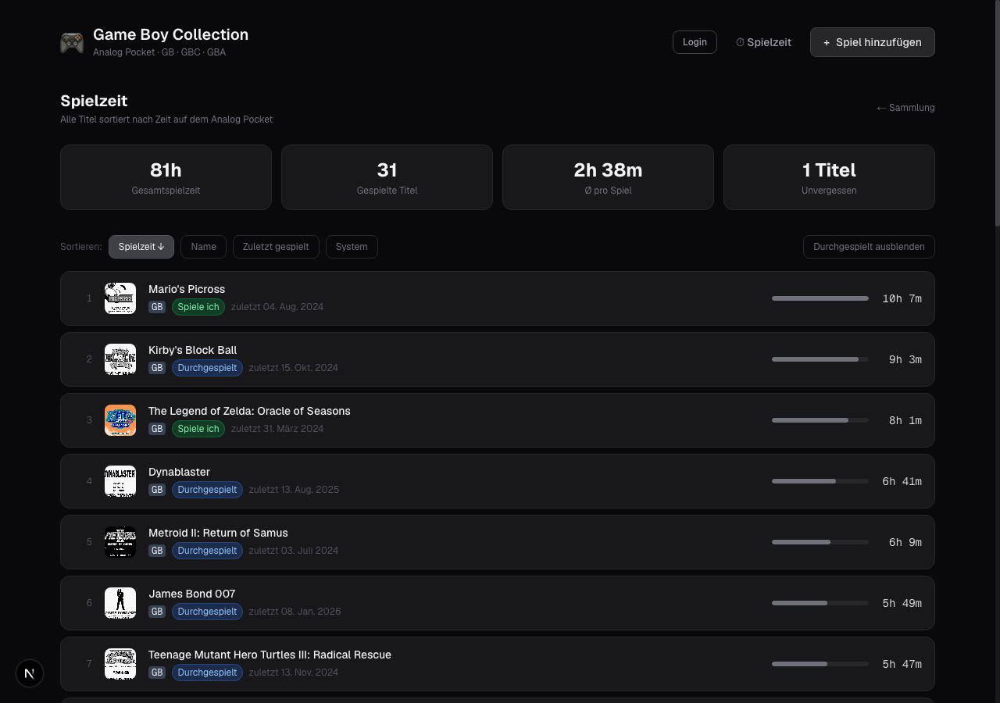

<table><tr><td></td><td><h1>Game Boy Collection</h1></td></tr></table>

A self-hosted web app to manage your Game Boy cartridge collection — with direct integration of the **Analogue Pocket**. Play times, cover art and session data are automatically imported from the SD card.

> Built with Next.js · TypeScript · Tailwind CSS · Docker

---

## Screenshots

### Game Overview


The main view shows all games as cards with cover art (automatically pulled from the Analogue Pocket library) or virtual cartridge renders. Status badge, star rating and play time are shown per card. The stat tiles at the top act as quick filters; full search and filter controls are below.

### Game Detail


The detail page shows play time, session count, last played date and notes. A Cartridge / Cover toggle switches between the virtual cartridge view and the Pocket library cover image. When logged in, all fields can be edited, a cartridge photo can be uploaded and the "lent out" flag can be toggled.

### Play Time Ranking


A sortable leaderboard of all played titles with progress bar, total play time and average per game. Sort by play time, name, last played date or system.

---

## Features

- **Automatic import** from the Analogue Pocket SD card
  - Play times and sessions from `list.bin` / `playtimes.bin`
  - Cover art from the Library (GB · GBC · GBA)
  - Title matching via No-Intro database (~8,400 entries)
  - Reset protection: if Pocket data is lower than stored, play times are added rather than overwritten
- **Pocket Sync upload** — upload `list.bin` and `playtimes.bin` directly via the web UI (no SD card reader needed)
- **Game management**
  - Status: Playing · Completed · Owned · Wishlist
  - Star rating (1–5)
  - Notes with clickable URLs, purchase price, lent-out flag
  - Custom cartridge photo upload (JPEG, HEIC supported; EXIF rotation applied automatically)
  - Virtual cartridge render with label placed in the cartridge shell
  - Cartridge / Cover toggle on the detail page when both images are available
- **Filtering & search**
  - Full-text search (title, publisher, genre)
  - Filter by status, platform, minimum rating, lent-out
  - Filter state persisted in the URL — navigating back restores the last search
  - Clickable stat tiles as quick filters
- **Play time view** with ranking, sorting and "hide completed" toggle
- **AI game info** *(requires OpenAI API key)* — per-game panel with game description, developer/publisher/genre, press review scores pulled from Wikipedia, gameplay screenshots, and a YouTube link. Results are cached locally so each title is only fetched once.
- **AI cartridge label crop** *(requires OpenAI API key)* — when uploading a cartridge photo, the AI automatically detects and crops the label area.
- **Password protection** — reading is always public, editing requires login
- **Docker-ready** — a single `docker compose up`

---

## Requirements

- Docker & Docker Compose
- An **Analogue Pocket** SD card (or the Library Image Set, see below)
- An **OpenAI API key** *(optional)* — only needed for AI features

---

## Setup

### Installation via Docker Hub

The easiest way to run Game Boy Collection is via the official Docker image:

**[hub.docker.com/r/jakez/gameboy-collection](https://hub.docker.com/r/jakez/gameboy-collection)**

No clone required — create a `compose.yaml` with the following content:

```yaml
services:
  gameboy-collection:
    image: jakez/gameboy-collection:latest
    ports:
      - "3000:3000"
    volumes:
      - ./data:/app/data                                        # all app data (required)
      - ./analogue-pocket-library:/analogue-pocket-library:ro   # Pocket Library images (read-only)
    environment:
      - ADMIN_PASSWORD=your-password    # omit for open access
      - POCKET_LIBRARY_DIR=/analogue-pocket-library
      # - OPENAI_API_KEY=sk-...        # optional: enables AI features
    restart: unless-stopped
```

Then start with:

```bash
docker compose up -d
```

The app is available at **http://localhost:3000**.

---

### Preparing the Analogue Pocket Library (one-time)

The Library folder contains small cover screenshots that the Analogue Pocket generates for every game you've played. These are stored on the SD card and are used as thumbnails throughout the app.

**Steps:**

1. Eject the SD card from your Analogue Pocket
2. On the SD card, navigate to `System/Library/`
3. Copy the entire `Library/` folder to your server next to `compose.yaml`:

```
your-server/
├── compose.yaml
├── analogue-pocket-library/    ← copy Library/ contents here
│   └── Images/
│       ├── GB/                 ← Game Boy covers (.bin)
│       ├── GBC/                ← Game Boy Color covers (.bin)
│       └── GBA/                ← Game Boy Advance covers (.bin)
└── data/                       ← created automatically by the app
```

This folder is mounted **read-only** — the app never writes to it. You only need to update it when new games appear in your library.

> **Don't have an Analogue Pocket yet?** A pre-built Library Image Set is available for download — see the [Library image set](#library-image-set) section below.

Play time data (`list.bin` / `playtimes.bin`) is uploaded via the web UI — **no SD card reader needed** after the initial library copy.

---

### First-run setup wizard

When you open the app for the first time (or after clearing the data folder), a guided setup wizard walks you through three steps:

**Step 1 — No-Intro Database**

Upload the XML database files from [datomatic.no-intro.org](https://datomatic.no-intro.org). These contain the full title list for all ~8,400 Game Boy, Game Boy Color and Game Boy Advance games. Once imported, every game is available for selection when adding titles to your collection — no manual typing needed. The database also enables automatic artwork matching.

Download: `Download` → `DB` → select *Nintendo - Game Boy*, *Game Boy Color*, and *Game Boy Advance* → `Prepare` → `Download` (repeat for each system).

**Step 2 — Library Images**

The wizard detects the `.bin` files in `analogue-pocket-library/` and converts them to PNG in one batch — a progress bar shows the conversion status. If no library images are found, the wizard explains where to get them.

**Step 3 — Pocket Sync (optional)**

Upload `list.bin` and `playtimes.bin` from `System/Played Games/` on the SD card to import your play history. This step can be skipped and repeated any time via the **Pocket Sync** page in the app.

> After the initial setup, `/setup` is password-protected — re-running it requires the admin password.

---

### Keeping play times up to date

After each gaming session, upload the two files from your SD card via the **Pocket Sync** page in the web UI:

```
SD card/System/Played Games/list.bin
SD card/System/Played Games/playtimes.bin
```

The uploaded files are stored in `data/analogue-pocket-playedgames/` and processed immediately. Play times are merged intelligently — if the Pocket shows less time than stored (e.g. after a reset), the values are added rather than overwritten.

---

### Volume reference

| Host path | Container path | Mode | Description |
|---|---|---|---|
| `./data` | `/app/data` | read-write | All app data: game database, converted images, cartridge photos, play time files |
| `./analogue-pocket-library` | `/analogue-pocket-library` | **read-only** | Analogue Pocket Library folder with cover images (`.bin` files) |

### Environment variables

| Variable | Default | Description |
|---|---|---|
| `ADMIN_PASSWORD` | *(empty)* | Login password. Empty = open access (no login required) |
| `OPENAI_API_KEY` | *(empty)* | Required for AI game info and AI cartridge label crop |
| `POCKET_LIBRARY_DIR` | `/analogue-pocket-library` | Path to the Library folder inside the container |

---

## Public Read-Only API

Two unauthenticated endpoints are available for external integrations (e.g. Vestaboard). Both return JSON with `Cache-Control: no-store` and `Access-Control-Allow-Origin: *`.

### `GET /api/public/activity`

Returns a digest of collection activity — useful for displaying what has been recently played or added.

**Response**

```json
{
  "lastSync": {
    "syncedAt": "2026-04-28T14:35:00.000Z",
    "daysAgo": 49
  },
  "newlyAdded": [
    { "id": "tetris", "title": "Tetris", "platform": "GB", "status": "playing", "createdAt": "2026-04-28T14:35:00.000Z" }
  ],
  "recentlyPlayed": [
    { "id": "tetris", "title": "Tetris", "platform": "GB", "status": "playing", "playtime": 320, "rating": 5 }
  ],
  "stats": {
    "totalGames": 42,
    "totalPlaytimeMin": 8430,
    "playing": 3,
    "completed": 18,
    "backlog": 15,
    "wishlist": 6
  }
}
```

- `newlyAdded` — games added since the last Pocket Sync import
- `recentlyPlayed` — top 10 games by total playtime (minutes)
- `lastSync.syncedAt` is `null` if no Pocket Sync has been performed yet

---

### `GET /api/public/games`

Returns the full game collection. Supports optional query parameters for filtering and sorting.

**Query parameters**

| Parameter | Values | Description |
|---|---|---|
| `platform` | `GB` · `GBC` · `GBA` | Filter by platform |
| `status` | `playing` · `completed` · `backlog` · `wishlist` | Filter by status |
| `sort` | `title` (default) · `playtime` · `rating` · `added` | Sort order |

**Response**

```json
{
  "total": 42,
  "games": [
    {
      "id": "tetris",
      "title": "Tetris",
      "platform": "GB",
      "year": 1989,
      "status": "playing",
      "rating": 5,
      "playtime": 320,
      "notes": "",
      "lent": false,
      "purchasePrice": "12.50",
      "romCrc": "46df91ad",
      "createdAt": "2026-04-28T14:35:00.000Z"
    }
  ]
}
```

**Examples**

```bash
# All GBA games sorted by playtime
curl http://localhost:3000/api/public/games?platform=GBA&sort=playtime

# Currently playing games
curl http://localhost:3000/api/public/games?status=playing

# Activity digest for Vestaboard
curl http://localhost:3000/api/public/activity
```

---

## Library image set

No demo data is included in this repository. To get cover art without an Analogue Pocket SD card, a pre-built **Library Image Set** is available for download:

**[Download Library-Image-Set-v1.0.zip](https://www.dropbox.com/scl/fi/bdtrnrkumfisn0qb35k2w/Library-Image-Set-v1.0.zip?rlkey=7bhva23z55dxyngtqrj54kus4&dl=1)**

Unzip and place the contents so the folder structure matches what the Pocket uses:

```
analog-pocket-data/
└── library/
    └── Images/
        ├── GB/     ← *.bin cover files
        ├── GBC/
        └── GBA/
```

Then point the `POCKET_LIBRARY_DIR` volume at `./analog-pocket-data/library` in `compose.local.yaml`. Play time data (`list.bin` / `playtimes.bin`) must come from a real Pocket SD card or be uploaded via the Pocket Sync page.

---

## Backup

The entire database lives in `data/games.json`. Cover art and photos are in `data/library/` and `data/cartridges/`. A simple backup:

```bash
cp -r data/ data-backup-$(date +%Y%m%d)/
```

---

## Development

```bash
npm install
echo "ADMIN_PASSWORD=dev" > .env.local
npm run dev
```

App runs at http://localhost:3000

---

## Tech Stack

- **Next.js 15** (App Router, Standalone Build)
- **TypeScript**
- **Tailwind CSS v4**
- **Python 3** (import script for Analogue Pocket data)
- **Docker** (Alpine image, ~200 MB)
